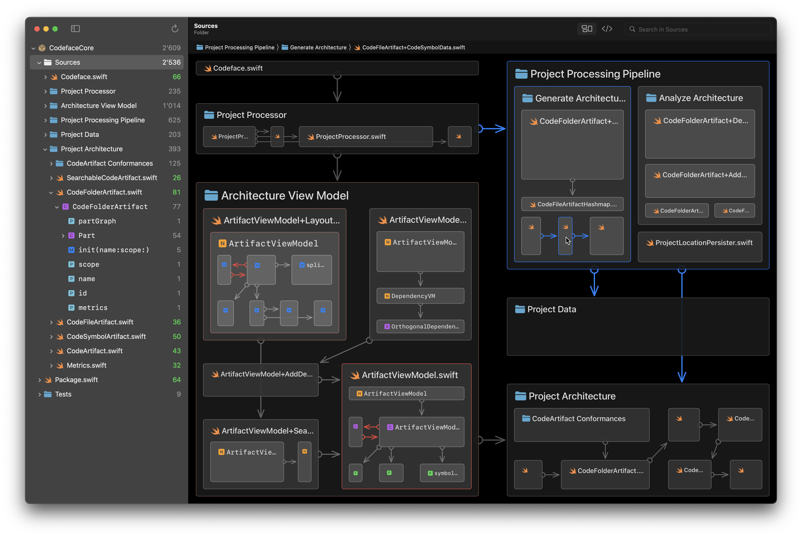

# Codeface

## See the Architecture of Any Codebase

## Watch a Video and Learn More

**Website:** [codeface.io](https://codeface.io)  

## Install from the Apple Mac App Store

**App Store:** [Codeface on the Mac App Store](https://apps.apple.com/app/codeface/id1578175415)

## Give Feedback – We Read It

**GitHub issues:** [Open issues on GitHub](https://github.com/nohype-ai/Codeface/issues) to send us ideas, feature requests, or bugs.

## Use Our Open-Source and Contribute

**GitHub orga:** [The Nohype AI orga](https://github.com/nohype-ai) hosts some of Codeface's infrastructure as open-source Swift packages.

## Stay Tuned

Development has picked up again and continues in private, more determined than ever. This public repo is now the home for your feedback.

🚀 More is to come here and soon for Codeface. Stay tuned!
